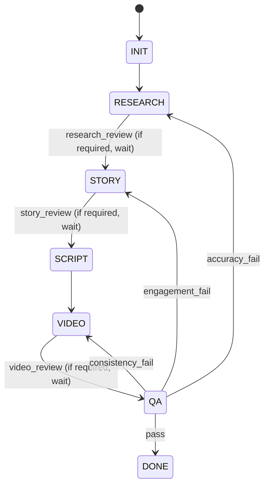

# LangGraph Topology Design (Task 7)

## 目的
LangGraph上で **一貫した生成パイプライン** を実現するための
状態・遷移・ゲート・再試行・サブグラフ構成を定義する。

## 参照
- `docs/orchestration-and-ops.md`
- `docs/data-contracts.md`
- `workflow/state-schema.txt`

## トップレベル状態

```
INIT → RESEARCH → STORY → SCRIPT → VIDEO → QA → DONE
```

- MVPは上記のみ（PUBLISH/ANALYZE/IMPROVEは対象外）
- 各ステージは **成果物を確定** して次へ進む

## 実行トリガー

- 起点は **Claude Code の slash command**
- 全体を統括するエージェントが `state.txt` を更新
- サブ作業は **skills** として定義されたエージェントを呼び出す

## 状態遷移（概念図）



## レビューゲート設計

- ゲート値: `required | optional | skipped`
- デフォルト（運用方針）:
  - research_review: `required`
  - story_review: `optional`
  - video_review: `required`
- `required` の場合は人間承認待ちで停止
- `optional` の場合は自動判定で通過可能（人間が介入するなら停止）
- `skipped` は無条件通過

## QA再試行ルール

`docs/orchestration-and-ops.md` の閾値を採用:
- `accuracy_score < 0.75` → `RESEARCH` に戻る
- `engagement_score < 0.7` → `STORY` に戻る
- `consistency_score < 0.7` → `VIDEO` に戻る

### 再試行上限（設計案）
- 同一ステージの自動再試行は **最大2回**
- 超過時は **人間レビューゲート**へ昇格
- 上限値は将来 `config/system.yaml` で可変化

## サブグラフ設計

### 1) SCRIPT：シーン作成ループ

```
ScenePlan → DraftScene → ReviewScene → (ReviseScene)* → Accept
```

- **DraftScene**: シーン単位で執筆
- **ReviewScene**: 前後の脈絡・整合性チェック
- **ReviseScene**: 修正依頼がある場合のみ
- 失敗が連続した場合は **人間ゲートへ移行**

**境界条件**
- 1シーンずつ直列（前後関係の一貫性のため）
- 全シーン承認後に `script.md` を確定

### 2) VIDEO：シーン素材生成

```
For each approved scene:
  GenerateImage
  GenerateTTS
  GenerateClip
  ValidateAssets
```

- 1シーン内の素材生成は **独立** しているため並列実行可
- 各シーンは承認済みのものから順次着手（次シーン作成中でも進めてよい）
- 失敗時は **素材単位** で再試行（最大2回）

#### VIDEO内の最終合成

```
AssembleTimeline → RenderVideo → ValidateVideo
```

- `RenderVideo` で `video.mp4` を確定
- `ValidateVideo` で長さ/比率/字幕/音ズレを検査

## データフロー（入出力）

### RESEARCH
- Input: topic, constraints
- Output: `research.md`（テンプレ: `workflow/research-template.yaml`）

### STORY
- Input: `research.md`
- Output: `story.md`（テンプレ: `workflow/story-template.yaml`）

### SCRIPT
- Input: `story.md`
- Output: `script.md`（テンプレ: `workflow/script-template.yaml`）

### VIDEO
- Input: `script.md`
- Output: `video.mp4`, `video_manifest.md`, `assets/*`

### QA
- Input: `video.mp4`, `script.md`, `story.md`, `research.md`
- Output: QAスコア・判定（DB / manifest）

## 状態（LangGraph state）

状態は **`output/<topic>_<timestamp>/state.txt`** に追記型で記録する。
フォーマットは key=value（簡易テキスト）。詳細は `workflow/state-schema.txt`。

追加のランタイム項目は以下の形式で記録する：

```
runtime.attempts.research=0
runtime.attempts.story=0
runtime.attempts.script=0
runtime.attempts.video=0
runtime.scene.1.status=draft
runtime.scene.1.attempts=0
last_error=null
```

## 失敗時の扱い

### エラー分類
- **retryable**: ネットワーク、APIレート制限、一時的失敗
- **non-retryable**: 入力不正、ポリシー違反、致命的整合性崩壊

### リトライ方針
- retryable は指数バックオフで最大2回
- non-retryable は即時に人間レビューへ

## チェックポイント

- ステージ完了時に `state.txt` に追記
- SCRIPT/VIDEOは **シーン単位** でも追記
- 途中停止 → 最後のブロックを読み込んで再開
- ロールバックは **過去ブロックのコピー** で擬似的に再現

## 監査ログ

- ステージ遷移ごとに `audit.steps` に追記
- reviewer = `human | auto`
- notes に判定理由を残す

## 受け入れ条件

- トップレベル状態・QA再試行・ゲート条件が明記されている
- SCRIPT/VIDEO のサブグラフが明確
- 失敗時/再試行/チェックポイントの扱いが定義済み
