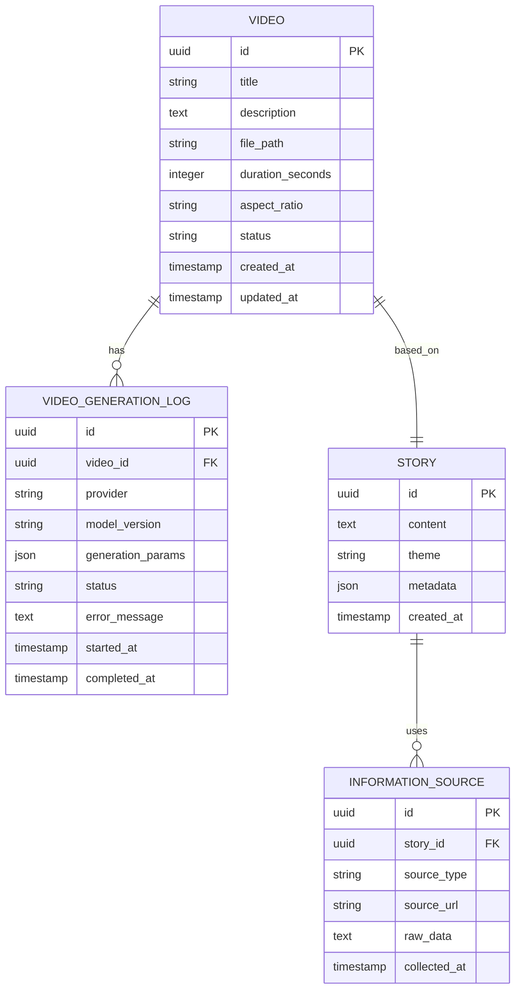

# データベース設計書

## 概要

TikTok Story Creator (ToC) プロジェクトのデータベース設計ドキュメント。

**データベース**: PostgreSQL 14+
**ORM**: SQLAlchemy / Django ORM（実装時に決定）

---

## ER図



---

## テーブル定義

### 1. videos（動画）

TikTok動画の基本情報を保存。

| カラム名 | 型 | NULL | デフォルト | 説明 |
|---------|---|------|-----------|------|
| id | UUID | NOT NULL | gen_random_uuid() | 主キー |
| title | VARCHAR(255) | NOT NULL | - | 動画タイトル |
| description | TEXT | NULL | - | 動画説明 |
| file_path | VARCHAR(500) | NOT NULL | - | 動画ファイルパス（Cloud Storage） |
| duration_seconds | INTEGER | NOT NULL | - | 動画の長さ（秒） |
| aspect_ratio | VARCHAR(10) | NOT NULL | '9:16' | アスペクト比 |
| status | VARCHAR(20) | NOT NULL | 'pending' | ステータス（pending/processing/completed/failed） |
| created_at | TIMESTAMP | NOT NULL | NOW() | 作成日時 |
| updated_at | TIMESTAMP | NOT NULL | NOW() | 更新日時 |

**インデックス**:
- `idx_videos_status` ON (status)
- `idx_videos_created_at` ON (created_at DESC)

---

### 2. stories（物語）

生成された物語テキストを保存。

| カラム名 | 型 | NULL | デフォルト | 説明 |
|---------|---|------|-----------|------|
| id | UUID | NOT NULL | gen_random_uuid() | 主キー |
| content | TEXT | NOT NULL | - | 物語本文 |
| theme | VARCHAR(100) | NULL | - | テーマ |
| metadata | JSONB | NULL | - | LLMプロンプト、パラメータ等 |
| created_at | TIMESTAMP | NOT NULL | NOW() | 作成日時 |

**インデックス**:
- `idx_stories_theme` ON (theme)
- `idx_stories_created_at` ON (created_at DESC)

---

### 3. information_sources（情報ソース）

物語生成に使用した情報ソースを記録。

| カラム名 | 型 | NULL | デフォルト | 説明 |
|---------|---|------|-----------|------|
| id | UUID | NOT NULL | gen_random_uuid() | 主キー |
| story_id | UUID | NOT NULL | - | 外部キー → stories.id |
| source_type | VARCHAR(50) | NOT NULL | - | ソースタイプ（news/trend/wikipedia等） |
| source_url | VARCHAR(500) | NULL | - | 情報源URL |
| raw_data | TEXT | NULL | - | 収集した生データ |
| collected_at | TIMESTAMP | NOT NULL | NOW() | 収集日時 |

**インデックス**:
- `idx_info_sources_story_id` ON (story_id)
- `idx_info_sources_type` ON (source_type)

**外部キー制約**:
- `fk_info_sources_story` FOREIGN KEY (story_id) REFERENCES stories(id) ON DELETE CASCADE

---

### 4. video_generation_logs（動画生成ログ）

動画生成プロセスのログと履歴を記録。

| カラム名 | 型 | NULL | デフォルト | 説明 |
|---------|---|------|-----------|------|
| id | UUID | NOT NULL | gen_random_uuid() | 主キー |
| video_id | UUID | NOT NULL | - | 外部キー → videos.id |
| provider | VARCHAR(50) | NOT NULL | - | プロバイダー名（veo/sora/kling等） |
| model_version | VARCHAR(50) | NULL | - | モデルバージョン |
| generation_params | JSONB | NULL | - | 生成パラメータ（JSON） |
| status | VARCHAR(20) | NOT NULL | 'running' | ステータス（running/success/failed） |
| error_message | TEXT | NULL | - | エラーメッセージ |
| started_at | TIMESTAMP | NOT NULL | NOW() | 開始日時 |
| completed_at | TIMESTAMP | NULL | - | 完了日時 |

**インデックス**:
- `idx_gen_logs_video_id` ON (video_id)
- `idx_gen_logs_provider` ON (provider)
- `idx_gen_logs_status` ON (status)

**外部キー制約**:
- `fk_gen_logs_video` FOREIGN KEY (video_id) REFERENCES videos(id) ON DELETE CASCADE

---

## リレーション

### 1対1
- `videos.id` ← `stories.id` (1つの動画は1つの物語に基づく)

### 1対多
- `stories.id` → `information_sources.story_id` (1つの物語は複数の情報ソースを使用)
- `videos.id` → `video_generation_logs.video_id` (1つの動画は複数の生成ログを持つ)

---

## マイグレーション戦略

### 初回セットアップ
```sql
-- UUIDエクステンション有効化
CREATE EXTENSION IF NOT EXISTS "uuid-ossp";

-- タイムスタンプ自動更新関数
CREATE OR REPLACE FUNCTION update_updated_at_column()
RETURNS TRIGGER AS $$
BEGIN
    NEW.updated_at = NOW();
    RETURN NEW;
END;
$$ LANGUAGE plpgsql;
```

### 更新時トリガー
```sql
CREATE TRIGGER update_videos_updated_at
BEFORE UPDATE ON videos
FOR EACH ROW
EXECUTE FUNCTION update_updated_at_column();
```

---

## パフォーマンス考慮事項

### インデックス戦略
- **頻繁な検索**: `status`, `created_at` にインデックス
- **外部キー**: 自動的にインデックス作成
- **JSONB**: 必要に応じてGINインデックス追加

### パーティショニング（将来的）
- `videos`テーブル: `created_at`による月次パーティショニング（データ量増加時）

---

## セキュリティ

### データ保護
- **機密情報**: APIキーやパスワードはこのDBに保存しない（環境変数使用）
- **ファイルパス**: Cloud Storageの署名付きURL使用
- **ユーザーデータ**: 現在は単一ユーザーのため不要（将来的にマルチユーザー対応時に追加）

### アクセス制御
- **アプリケーションユーザー**: 最小権限（CRUD権限のみ）
- **管理者ユーザー**: フルアクセス（マイグレーション用）

---

## 今後の拡張

### Phase 2: マルチユーザー対応
- `users`テーブル追加
- `videos.user_id`, `stories.user_id` 追加

### Phase 3: 分析機能
- `analytics`テーブル（視聴数、いいね数、収益等）
- `video_metadata`テーブル（タグ、カテゴリ等）

### Phase 4: スケジューリング
- `scheduled_videos`テーブル（予約投稿）
- `automation_rules`テーブル（自動化ルール）

---

## 参考資料

- PostgreSQL公式ドキュメント: https://www.postgresql.org/docs/
- SQLAlchemy: https://www.sqlalchemy.org/
- Django ORM: https://docs.djangoproject.com/en/stable/topics/db/

---

*最終更新: 2026-01-04*
